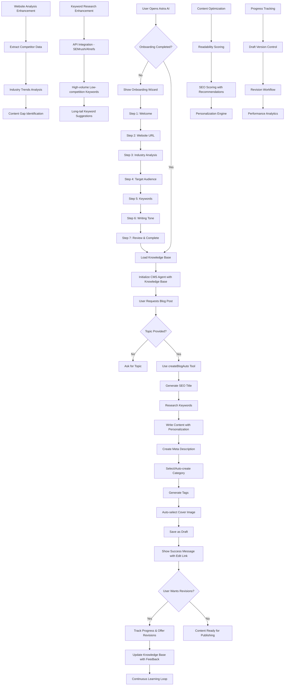

# Enhanced Astra AI Blog Post Agent - Implementation Plan

## Overview
This plan enhances the Astra AI blog post agent to create more effective, SEO-friendly, and personalized blog posts by integrating comprehensive onboarding, advanced website analysis, keyword research, and content optimization features.

## Current System Analysis
The existing system already includes:
- Onboarding wizard for collecting user details
- Knowledge base storage in database
- Website analysis using Tavily API
- Mastra AI framework with CMS agent
- Various tools: keyword research, SEO analysis, content strategy, blog auto-creation
- Readability suggestions and SEO analyzer tools

## Workflow Diagram

## Key Enhancement Areas

### 1. Onboarding Integration
- **Current**: Onboarding wizard exists but not triggered automatically
- **Enhancement**: Check onboarding status on agent page load, show wizard if incomplete

### 2. Advanced Website Analysis
- **Current**: Basic analysis using Tavily search
- **Enhancement**: 
  - Deeper crawling for existing content and keywords
  - Competitor analysis
  - Industry trend extraction
  - Content gap identification

### 3. Keyword Research Integration
- **Current**: AI-based keyword suggestions
- **Enhancement**: 
  - API integration with professional tools (SEMrush, Ahrefs)
  - Focus on high-volume, low-competition keywords
  - Industry-specific keyword clustering

### 4. Content Optimization
- **Current**: Basic readability and SEO analysis
- **Enhancement**:
  - Detailed SEO scoring (0-100) with category breakdowns
  - Readability improvements with specific suggestions
  - Personalization engine for tone/style adaptation

### 5. Dynamic Knowledge Base
- **Current**: Static storage of onboarding data
- **Enhancement**:
  - Continuous updates from user interactions
  - Learning from feedback and revisions
  - Performance tracking integration

### 6. Progress Tracking & Revisions
- **Current**: Basic draft creation
- **Enhancement**:
  - Version control for drafts
  - Revision workflow with tracked changes
  - Performance analytics post-publishing

## API Integrations Needed

1. **Website Crawling**: Bright Data, ScrapingBee, or similar for deep content extraction
2. **Keyword Research**: SEMrush API, Ahrefs API, or Google Keyword Planner API
3. **SEO Tools**: Integration with SEO analysis platforms
4. **Competitor Analysis**: Tools for competitor content and keyword analysis

## Implementation Phases

### Phase 1: Core Integration
- Add onboarding check to agent page
- Enhance website analysis with competitor data
- Improve keyword research with API integration

### Phase 2: Content Optimization
- Enhance readability and SEO scoring tools
- Implement personalization engine
- Add progress tracking for revisions

### Phase 3: Advanced Features
- Content strategy dashboard
- Automated content calendar
- A/B testing framework

### Phase 4: Analytics & Learning
- Performance tracking integration
- Continuous learning from user feedback
- Predictive content suggestions

## Success Metrics
- Increased blog post quality scores
- Higher SEO rankings for generated content
- Reduced time to publish optimized content
- Improved user satisfaction with personalization
- Higher engagement rates on published posts